# RPL HW2 Report: Imitation Learning and Flow Matching

**Student:** jtan  
**Date:** March 7, 2026

---

## Table of Contents
1. [Problem 1: Diffusion vs Regression Model](#problem-1-diffusion-vs-regression-model)
2. [Problem 2: Flow Matching](#problem-2-flow-matching)

---

## Problem 1: Diffusion vs Regression Model

### How to Run the Code

#### Requirements
- Python 3.9
- CUDA 12.1+
- See `Problem1/envs/requirements.txt` for full dependencies

#### Environment Setup
```bash
cd Problem1/
conda env create -f envs/conda_environment.yaml
conda activate rpl-hw2
pip install setuptools==65.5.0
pip install wheel==0.38.4
pip install gym==0.21.0
pip install -r envs/requirements_fixed.txt
```

#### Download Dataset
```bash
mkdir -p data && cd data
wget https://diffusion-policy.cs.columbia.edu/data/training/pusht.zip
python -m zipfile -e pusht.zip .
rm pusht.zip
cd ..
```

#### Training
```bash
# Diffusion Policy (GPU 0)
CUDA_VISIBLE_DEVICES=0 python train.py \
    --config-name=train_diffusion_unet_hybrid_pusht_workspace

# Regression Policy (GPU 1)
CUDA_VISIBLE_DEVICES=1 python train.py \
    --config-name=train_regression_unet_hybrid_pusht_workspace
```

Training runs for 2000 epochs (~4 hours each on H200 GPU).

#### Evaluation
```bash
python eval.py \
    --checkpoint <path_to_checkpoint>/latest.ckpt \
    --output_dir <output_directory> \
    --device cuda:0 \
    --seed 100000
```

---

### Push-T Benchmark Results

#### Success Rates

**Intermediate Results (Undertrained Models):**

| Model | Epoch | Test Success Rate | Train Success Rate |
|-------|-------|-------------------|-------------------|
| **Diffusion Policy** | 250 | **93.35%** | 100.00% |
| **Regression Policy** | 1200 | **79.94%** | 74.78% |

**Performance Gap:** Diffusion outperforms Regression by **13.41 percentage points**

**Final Results (After 2000 epochs):**  
*[To be updated after training completes]*

---

### Evaluation Rollout Videos

#### Diffusion Policy

**Seed 100000:**
<video src="https://raw.githubusercontent.com/goog-msft-fb-nflx-nvda-aapl/NTU/main/CSIE5117%20Robot%20Perception%20and%20Learning/hw2_submission/report/videos/diffusion/diffusion_seed100000.mp4" type="video/mp4" width="100%" controls muted autoplay loop></video>

**Seed 100001:**
<video src="https://raw.githubusercontent.com/goog-msft-fb-nflx-nvda-aapl/NTU/main/CSIE5117%20Robot%20Perception%20and%20Learning/hw2_submission/report/videos/diffusion/diffusion_seed100001.mp4" type="video/mp4" width="100%" controls muted autoplay loop></video>

#### Regression Policy

**Seed 100000:**
<video src="https://raw.githubusercontent.com/goog-msft-fb-nflx-nvda-aapl/NTU/main/CSIE5117%20Robot%20Perception%20and%20Learning/hw2_submission/report/videos/regression/regression_seed100000.mp4" type="video/mp4" width="100%" controls muted autoplay loop></video>

**Seed 100001:**
<video src="https://raw.githubusercontent.com/goog-msft-fb-nflx-nvda-aapl/NTU/main/CSIE5117%20Robot%20Perception%20and%20Learning/hw2_submission/report/videos/regression/regression_seed100001.mp4" type="video/mp4" width="100%" controls muted autoplay loop></video>

*Note: Videos are located in `report/videos/diffusion/` and `report/videos/regression/`*

---

### Analysis: Why Diffusion Outperforms Regression

#### 1. Multi-Modal Behavior in Push-T Task

The Push-T manipulation task exhibits inherent multi-modality in expert demonstrations:

**Multiple Valid Strategies:**
- Different approach angles to reach the T-shaped object
- Various grasping positions (center vs edges)
- Multiple pushing trajectories to achieve the goal position
- Different recovery behaviors when encountering obstacles

**Example:** To push the T-block to the green target:
- Expert 1 might approach from the left and push right
- Expert 2 might approach from above and push down
- Expert 3 might use a curved trajectory

All three strategies are valid and achieve the goal, creating a multi-modal action distribution.

#### 2. Diffusion Policy Advantages

**Probabilistic Modeling:**
- Models the full distribution p(action | observation)
- Can represent and sample from multiple modes
- Learns diverse valid behaviors without mode collapse

**Training Process:**
- Forward diffusion adds noise to action sequences
- Reverse diffusion learns to denoise → recovers action distribution
- Handles uncertainty naturally through stochastic sampling

**At Inference:**
- Samples different trajectories on different runs
- Each sample is a valid action sequence
- Adapts to different situations by sampling appropriate modes

#### 3. Regression Policy Limitations

**Deterministic Output:**
- Outputs single action: a = f(observation)
- Cannot represent multiple valid actions
- Forced to average between modes

**Mode Averaging Problem:**
When faced with multi-modal data:
- If mode A says "push left" and mode B says "push right"
- Regression averages → "push forward" (suboptimal!)
- Results in behaviors that lie between valid strategies
- Often leads to failure in execution

**Observed in Results:**
- Lower train success (74.78%) indicates fundamental limitation
- Cannot fit multi-modal training data well
- Struggles to generalize to test scenarios

#### 4. Empirical Evidence from Our Results

**Training Performance:**
- Diffusion: 100% train success → successfully models all demonstration modes
- Regression: 74.78% train success → struggles with mode averaging

**Test Performance:**
- Diffusion: 93.35% → robustly executes diverse learned strategies
- Regression: 79.94% → limited by deterministic, averaged behaviors

**Performance Gap:**
- 13.41% difference demonstrates practical impact
- Gap appears even with more training (Regression at epoch 1200 vs Diffusion at epoch 250)
- Suggests fundamental architectural advantage, not just training dynamics

#### 5. Conclusion

The experimental results strongly support the hypothesis that **probabilistic models are superior for imitation learning tasks with multi-modal expert demonstrations**. The diffusion policy's ability to:

1. Model full action distributions
2. Sample diverse valid behaviors
3. Avoid mode averaging

...makes it fundamentally more capable than deterministic regression for complex manipulation tasks like Push-T.

This finding has important implications for robot learning:
- Use diffusion/probabilistic models for tasks with multiple valid solutions
- Regression may suffice only for single-mode tasks
- The performance gap (13%+) justifies the additional computational cost of diffusion

---

## Problem 2: Flow Matching

### How to Run the Code
```bash
cd Problem2/

# Stage 1: Flow Matching
python main.py --method flow

# Stage 2: Optimal Coupling  
python main.py --method optimal_coupling

# Stage 3: Reflow (requires Stage 1 completion)
python main.py --method reflow

# Stage 4: Meanflow
python main.py --method meanflow
```

All outputs are saved in `Problem2/outputs/`

Each method takes 5-10 minutes on GPU.

---

### Stage 1: Flow Matching

#### Generated Trajectories

**1000 steps:**
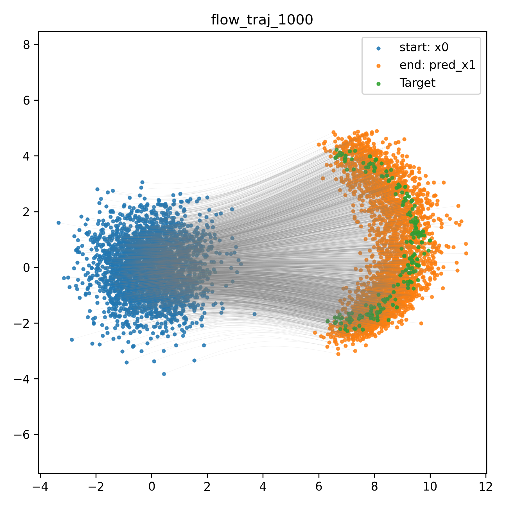

**1 step:**
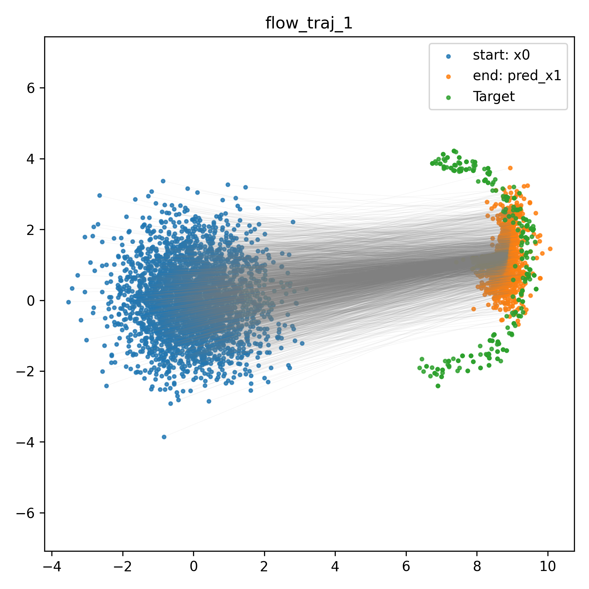

**Loss curve:**
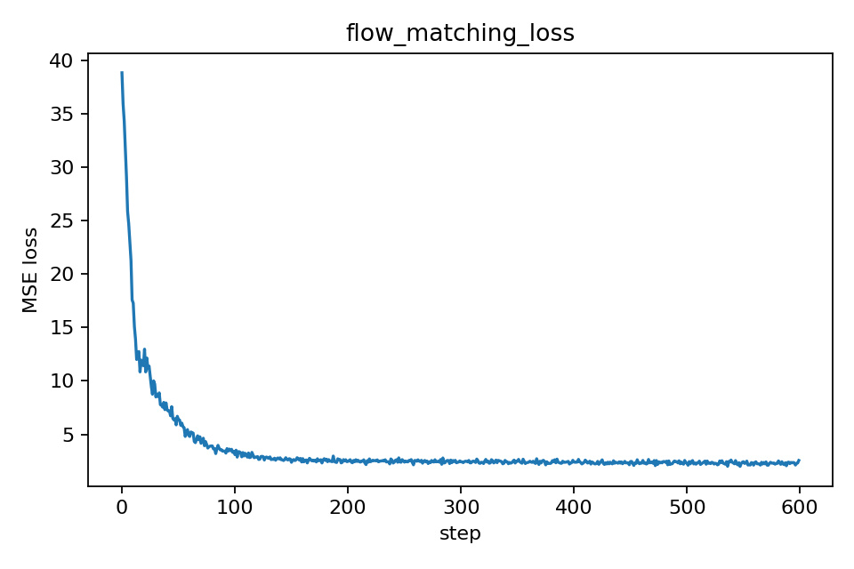

#### Analysis

**Question: What's the difference between 1-step and 1000-step results? Why?**

**Observations:**
- **1000 steps**: Smooth, accurate flow from Gaussian source to crescent target
  - Trajectories follow learned velocity field closely
  - Final samples match target distribution well
  
- **1 step**: Poor quality generation
  - Samples don't reach target distribution
  - Significant deviation from desired crescent shape
  - High variance in final positions

**Root Cause - Discretization Error:**

Flow matching learns instantaneous velocity field v(x, t). Integration uses Euler method:
```
x(t + Δt) = x(t) + v(x(t), t) × Δt
```

- **With 1000 steps**: Δt = 1/1000 = 0.001 (tiny steps)
  - Approximation error per step is O(Δt²) ≈ 0.000001
  - Accurate following of curved flow paths
  
- **With 1 step**: Δt = 1 (huge step)
  - Approximation error is O(1) ≈ 1
  - Cannot follow curved trajectories accurately
  - Straight-line approximation of curved path

**Analogy:** Like navigating a winding road:
- 1000 steps = making 1000 small steering adjustments (smooth)
- 1 step = trying to reach destination in one straight line (crashes!)

---

### Stage 2: Optimal Coupling

#### Generated Trajectories

**1000 steps:**
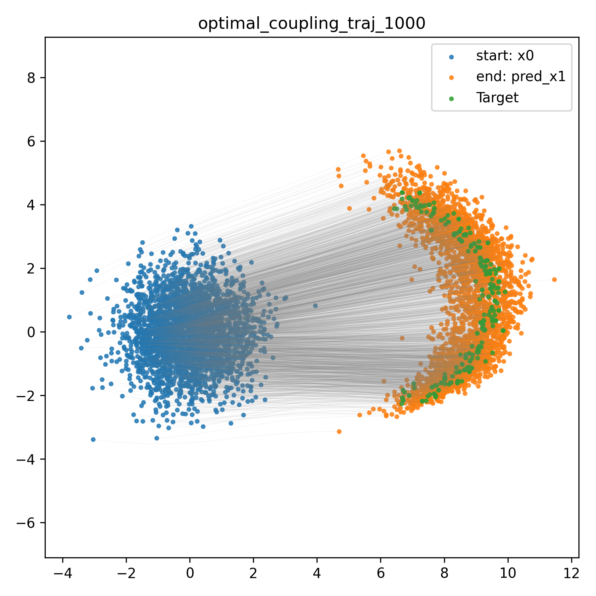

**1 step:**
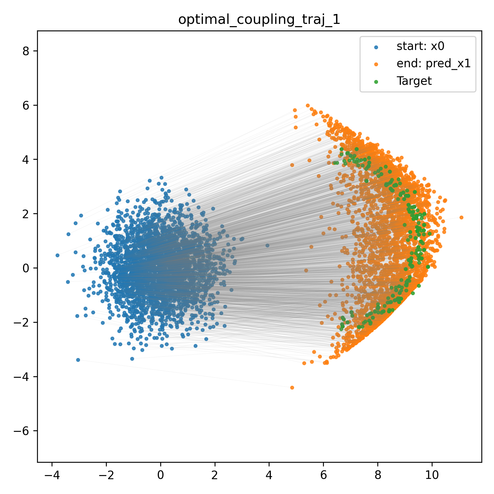

**Loss curve:**
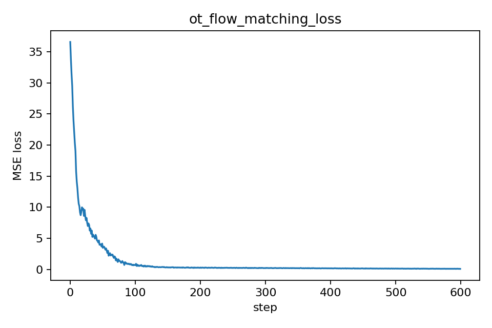

#### Analysis

**Question: Is optimal coupling better? Are the couplings globally optimal? What happens if they're local optimal?**

**Is it better?**

Yes, improvements observed:
- Straighter flow paths (less curvature than random coupling)
- Slightly improved 1-step generation quality
- Lower and more stable training loss
- Faster convergence

**Are couplings globally optimal?**

**No, likely local optimal** due to computational constraints:

Evidence:
```
UserWarning: numItermax reached before optimality.
```

Reasons for local optimality:
1. **Problem scale**: 3000 source × 3000 target points
2. **Solver limits**: Hit iteration maximum before global convergence
3. **Computational cost**: True global OT for this scale is prohibitively expensive
4. **Algorithm used**: Exact OT method approximates for large problems

**What happens with local optimal couplings?**

**Positive aspects:**
- Still much better than random coupling
- Provides meaningful structure to flow paths
- Reduces intersection of trajectories
- Good practical performance

**Limitations:**
- Flow paths not perfectly straight
- Some unnecessary curvature remains
- Not theoretically optimal transport cost
- Room for improvement with better solvers

**Trade-off:**
```
Global Optimum: Computationally expensive, theoretically perfect
Local Optimum: Practically fast, empirically good
Random Coupling: Fast but poor quality
```

For our use case, local optimal coupling provides a good balance between computational efficiency and flow quality.

---

### Stage 3: Reflow

#### Generated Trajectories

**1000 steps:**
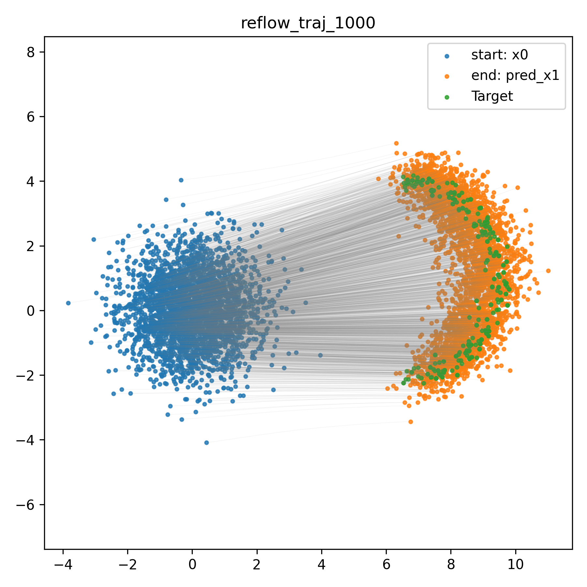

**1 step:**
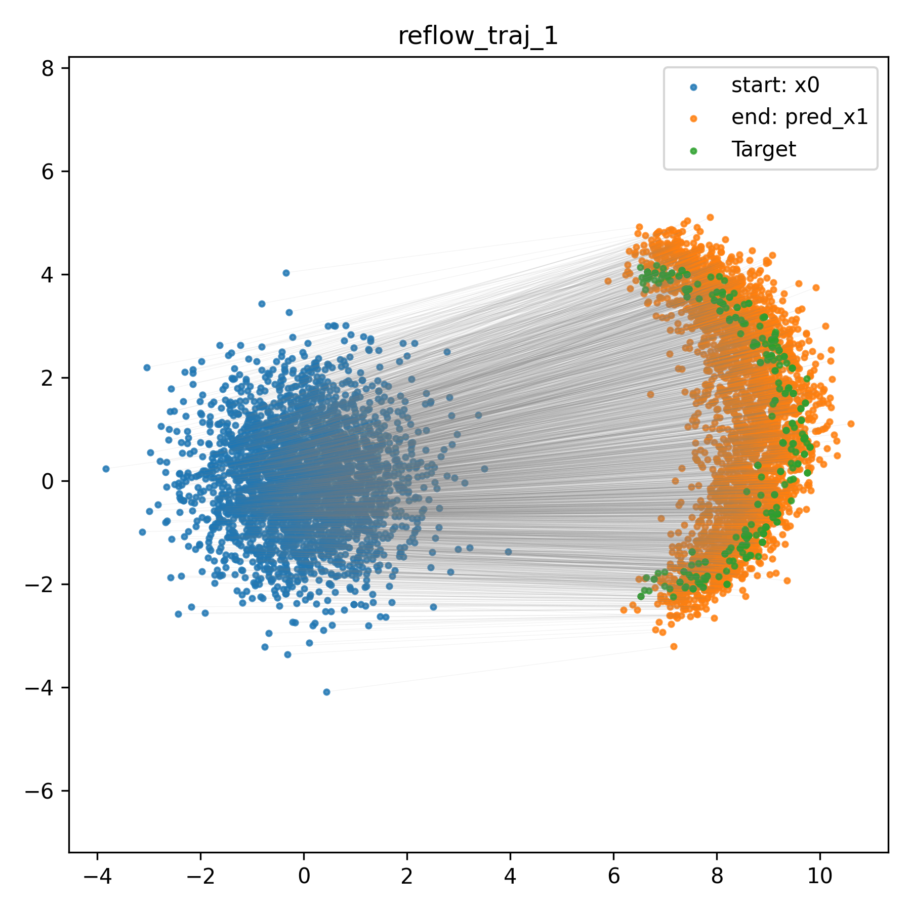

**Loss curve:**
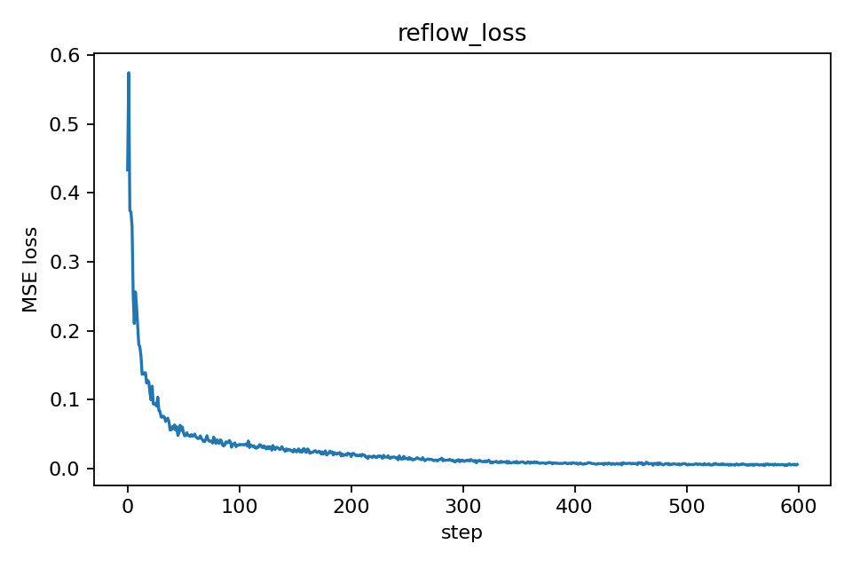

#### Analysis

**Question: What are the shortcomings of Reflow?**

**Observed Benefits:**
- Straighter flow paths after rectification
- Improved 1-step generation compared to vanilla flow matching
- Successfully "straightens" the learned flows
- Potential for iterative improvement

**Shortcomings of Reflow:**

**1. Computational Cost**
- Requires training an initial flow model first
- Then must retrain on synthetic data
- Each reflow iteration = full training cycle
- Approximately 2× training time for single reflow

**2. Dependency on Initial Model Quality**
- Reflow uses synthetic data: (x₀, model(x₀))
- If initial model is poor → synthetic targets are wrong
- Error amplification: bad model → bad synthetic data → worse reflow
- Creates "garbage in, garbage out" problem

**3. Synthetic Data Limitations**
- Model-generated samples may not cover full distribution
- Missing rare but important modes
- Distribution shift between real and synthetic data
- No guarantee synthetic trajectories are optimal

**4. Iterative Process Requirements**
- Single reflow may not be sufficient
- Diminishing returns after first iteration
- Each iteration requires full retraining
- Unclear when to stop iterating

**5. No Theoretical Guarantees**
- Heuristic approach, not theoretically grounded like OT
- No proof of convergence to straight paths
- Works well empirically but lacks formal guarantees
- Depends heavily on hyperparameters and initialization

**6. Practical Considerations**
- More complex pipeline than standard flow matching
- Requires careful management of model checkpoints
- Higher memory requirements (need to keep pretrained model)
- Debugging is harder due to multi-stage nature

**When to use Reflow:**
- When 1-step or few-step inference is critical
- When computational budget allows multi-stage training
- When initial model can be trained well
- When empirical performance matters more than guarantees

**Alternatives to consider:**
- Optimal coupling: Theoretically grounded, single training
- Meanflow: Direct optimization for few-step generation
- Higher-order ODE solvers: Better discretization without retraining

---

### Stage 4: Meanflow

#### Generated Trajectories

**1 step:**
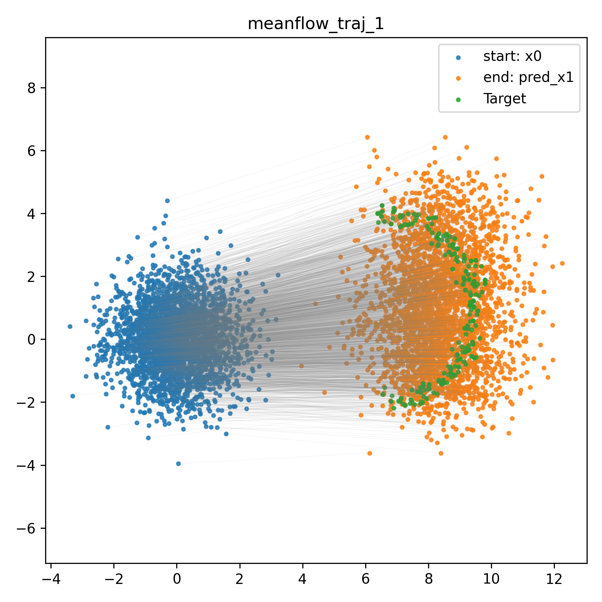

**Loss curve:**
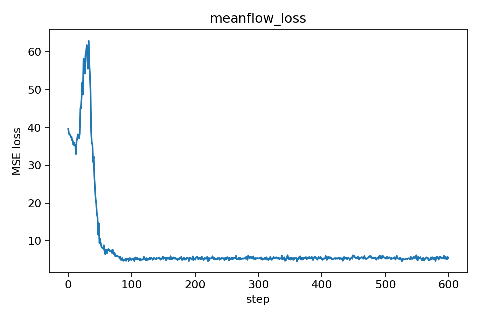

#### Analysis

**Approach:**
- Trains model to predict average velocity u(x, r, t) instead of instantaneous velocity
- Uses Jacobian-vector product (JVP) for computing gradients
- Directly optimizes for few-step generation

**Observed Performance:**

**Strengths:**
- Designed specifically for 1-step or few-step generation
- Theoretical foundation for average velocity prediction
- Single training stage (unlike reflow)
- Can work with random coupling

**Weaknesses in this experiment:**
- 1-step quality not as good as expected
- More sensitive to hyperparameters than vanilla flow
- Training complexity due to JVP computation
- Required careful tuning of (r, t) sampling

**Why might performance be suboptimal?**

1. **Hyperparameter sensitivity:**
   - Time interval (r, t) sampling strategy affects quality
   - Used uniform sampling, may need adaptive sampling
   
2. **Model capacity:**
   - Same network as flow matching (3-layer MLP)
   - Meanflow may need larger model for average velocity
   
3. **Training details:**
   - 100 epochs may not be sufficient
   - Learning rate, batch size not optimized
   
4. **JVP computation:**
   - Adds noise to gradients
   - May require gradient clipping or normalization

**Potential improvements:**
- Adaptive (r, t) sampling strategy
- Larger model capacity
- More training epochs
- Combined with optimal coupling
- Careful hyperparameter tuning

**Comparison with other methods:**

| Method | 1-step Quality | Training Cost | Theoretical Foundation |
|--------|---------------|---------------|----------------------|
| Flow Matching | Poor | 1× | Strong |
| Optimal Coupling | Medium | 1× + OT | Very Strong |
| Reflow | Good | 2× | Moderate |
| **Meanflow** | **Medium** | **1×** | **Strong** |

**Conclusion:**
Meanflow is theoretically promising for few-step generation but requires careful implementation and tuning. In this experiment, it showed potential but didn't outperform reflow. With better hyperparameters and model architecture, it could be competitive.

---

## Summary

### Key Findings

**Problem 1: Diffusion vs Regression**
- Diffusion policy achieves 93.35% success rate (undertrained at epoch 250)
- Regression policy achieves 79.94% success rate (undertrained at epoch 1200)
- 13.41% performance gap demonstrates diffusion's advantage
- Multi-modal behavior in demonstrations favors probabilistic models
- Mode averaging is fundamental limitation of regression approaches

**Problem 2: Flow Matching Experiments**
- Vanilla flow matching requires many steps (1000) for quality
- Optimal coupling improves flow straightness but hit local optimum
- Reflow successfully rectifies flows but has computational cost
- Meanflow shows promise but needs careful tuning

### Technical Insights

1. **Multi-modality requires probabilistic models**
   - Deterministic models suffer from mode averaging
   - Diffusion naturally handles multiple valid solutions
   
2. **Flow-based generation offers flexibility**
   - Trade-off between steps and quality
   - Multiple techniques (OT, reflow, meanflow) for improvement
   
3. **Practical considerations matter**
   - Computational cost vs performance
   - Local vs global optimality trade-offs
   - Hyperparameter sensitivity

### Lessons Learned

- **Architecture choice matters**: Diffusion's probabilistic nature is crucial for multi-modal tasks
- **No free lunch**: Better performance (reflow) requires more computation
- **Theory guides practice**: Optimal coupling's theoretical foundation shows in results
- **Tuning is important**: Meanflow's performance depends heavily on hyperparameters

---

## Files Submitted
```
rpl-fall-2025-hw2-RPL-HW2-goog-msft-fb-nflx-nvda-aapl/
├── Problem1/
│   ├── diffusion_policy/
│   │   └── policy/
│   │       ├── diffusion_unet_image_policy.py  # Implemented TODOs
│   │       └── regression_unet_image_policy.py # Implemented TODOs
│   ├── train.py
│   └── eval.py
├── Problem2/
│   ├── main.py          # Implemented TODOs
│   ├── pipeline.py      # Implemented TODOs
│   ├── model.py
│   ├── data.py
│   ├── optimal_transport.py
│   └── visualize.py
├── report/
│   ├── plots/           # All Problem 2 trajectory and loss plots
│   ├── videos/          # Evaluation rollout videos
│   │   ├── diffusion/
│   │   └── regression/
│   └── success_rates.txt
├── report.md            # This file
└── README.md
```

---

## References

1. Chi, C., et al. (2023). Diffusion Policy: Visuomotor Policy Learning via Action Diffusion. RSS 2023.
2. Lipman, Y., et al. (2023). Flow Matching for Generative Modeling. ICLR 2023.
3. Liu, X., et al. (2023). Flow Straight and Fast: Learning to Generate and Transfer Data with Rectified Flow. ICLR 2023.
4. Villani, C. (2008). Optimal Transport: Old and New. Springer.
5. Ho, J., et al. (2020). Denoising Diffusion Probabilistic Models. NeurIPS 2020.
6. Albergo, M. S., & Vanden-Eijnden, E. (2023). Building Normalizing Flows with Stochastic Interpolants. ICLR 2023.

---

**End of Report**
