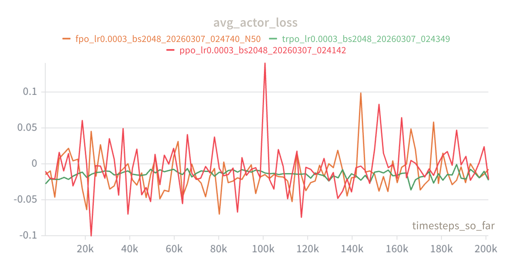
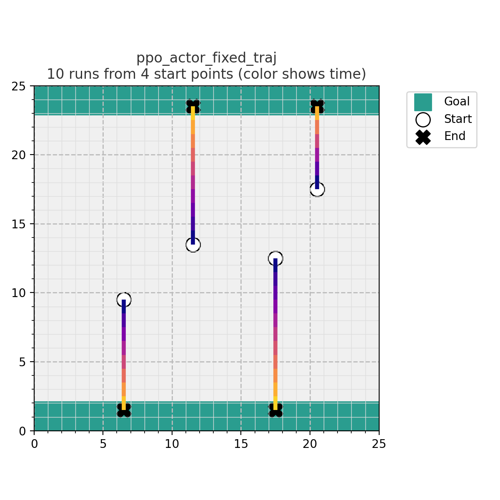
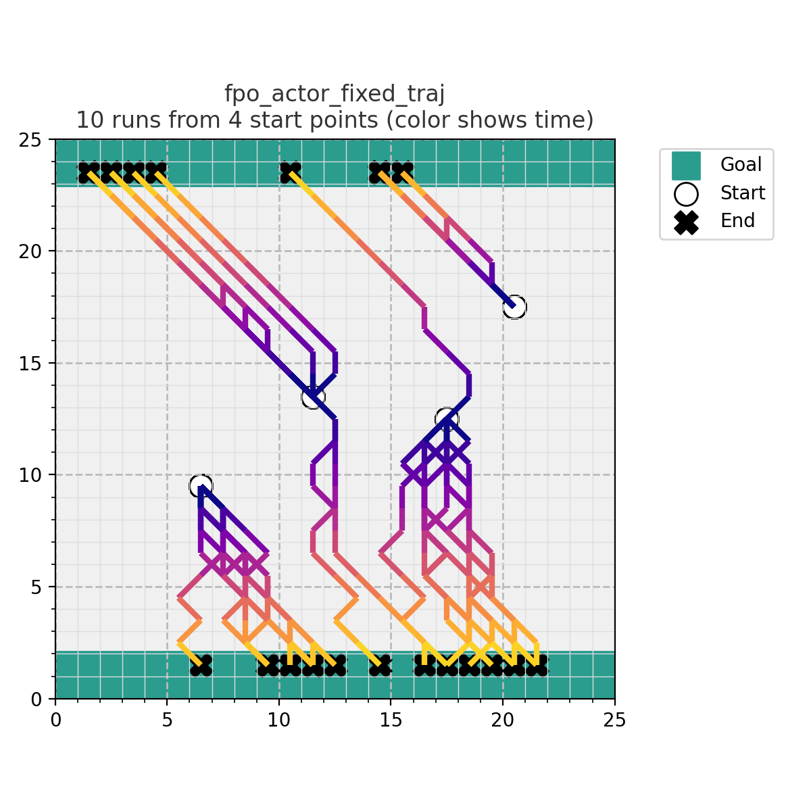

[](https://classroom.github.com/a/C4kPc08K)
# 2025 Fall RPL HW3 - GridWorld

### Installation
Dependencies (Python 3.10+):
```
conda create --name rpl_hw3 python=3.10 -y 
conda activate rpl_hw3
pip install -r requirements.txt
```

### Training
```bash
# Train with different policy optmization approaches
python main.py --mode train --method ppo
python main.py --mode train --method trpo
python main.py --mode train --method fpo

```
### Evaluate 100 runs then visualize the trajectories

To evaluate and visualize sample trajectory rollouts from fixed states:
```bash
# Evaluate and visualize in one step (recommended)
python eval_and_visualize_trajectories.py --actor_model path/to/ppo_actor.pth --method ppo
python eval_and_visualize_trajectories.py --actor_model path/to/trpo_actor.pth --method trpo
python eval_and_visualize_trajectories.py --actor_model path/to/fpo_actor.pth --method fpo
``` 

[](https://classroom.github.com/a/C4kPc08K)
# 2025 Fall RPL HW3 - GridWorld

### Installation
Dependencies (Python 3.10+):
```
conda create --name rpl_hw3 python=3.10 -y 
conda activate rpl_hw3
pip install -r requirements.txt
```

### Training
```bash
# Train with different policy optimization approaches
CUDA_VISIBLE_DEVICES=0 python main.py --mode train --method ppo
CUDA_VISIBLE_DEVICES=1 python main.py --mode train --method trpo
CUDA_VISIBLE_DEVICES=2 python main.py --mode train --method fpo
```

### Evaluate and Visualize Trajectories

```bash
python eval_and_visualize_trajectories.py --actor_model checkpoints/ppo_actor.pth --method ppo --episodes 10
python eval_and_visualize_trajectories.py --actor_model checkpoints/trpo_actor.pth --method ppo --episodes 10
python eval_and_visualize_trajectories.py --actor_model checkpoints/fpo_actor.pth --method fpo --episodes 10
```

---

## Report

### 1. Implementation

#### Part 1: PPO (`models/ppo.py`)

The clipped surrogate objective was implemented as follows:

- **Probability ratio**: `ratio = exp(log_π_new - log_π_old)`
- **Clipped surrogate**: `actor_loss = -mean(min(ratio * A, clamp(ratio, 1±ε) * A))`
- **Entropy bonus**: subtracted from actor loss to encourage exploration
- **Critic loss**: MSE between predicted value `V(s)` and the GAE target `A + V`
- **Early stopping**: approximate KL `= mean((ratio - 1) - log_ratio)` compared against `target_kl`

#### Part 2: TRPO (`models/trpo.py`)

- **Surrogate loss**: `L(θ) = -mean(r_t(θ) * A_t)` where `r_t = π_θ / π_old`, minimized via natural gradient
- **Trust-region step scaling**: `step_size = sqrt(2 * max_kl / (s^T F s + 1e-8))`, `full_step = -step_size * s`
- **Line search**: backtracking with acceptance condition `L_new ≤ L_old` AND `KL_new ≤ max_kl`

#### Part 3: FPO (`models/fpo.py`)

- **CFM loss difference**: for each state, N noise/time samples are collected during rollout. The current actor's CFM loss is recomputed and subtracted from the old actor's loss: `cfm_diff = L_old - L_new`
- **Policy ratio**: `ρ_s = exp(mean(clamp(cfm_diff, -3, 3)))` — analogous to the importance ratio in PPO
- **Clipped objective**: standard PPO clip applied with `ρ_s` in place of `r_t(θ)`

---

### 2. Results: Average Return

All three methods successfully reached the maximum return of **20.0** on the 25×25 GridWorld (`two_walls` mode) within 200,000 timesteps (~98 iterations).

| Method | Final Avg Return | Iterations | Timesteps |
|--------|-----------------|------------|-----------|
| PPO    | 20.0            | 98         | 201,138   |
| TRPO   | 20.0            | 98         | 201,144   |
| FPO    | 20.0            | 98         | 201,124   |

---

### 3. Actor Loss Curves (W&B)

The plot below shows `avg_actor_loss` vs. `timesteps_so_far` for all three methods, logged via Weights & Biases.



All three methods show a decreasing and stabilizing loss trend, consistent with convergence to the optimal policy.

---

### 4. Trajectory Visualization

Trajectories were evaluated from 4 fixed start points (10 episodes each). Color encodes time progression (early = dark, late = bright). All trajectories successfully reach the green goal regions (top or bottom rows of the grid).

#### PPO


#### TRPO


#### FPO


**Observations:**
- PPO and TRPO produce relatively direct trajectories toward the nearest goal region, reflecting unimodal Gaussian policies.
- FPO (flow-based policy) shows more diverse trajectories — from the same start point, episodes split between the top and bottom goal regions. This demonstrates the ability of the flow-matching policy to capture **multimodal action distributions**, which is not possible with a simple Gaussian actor.

---

### 5. Method Comparison

| Property | PPO | TRPO | FPO |
|----------|-----|------|-----|
| Policy class | Gaussian (MLP) | Gaussian (MLP) | Flow matching (diffusion) |
| Update mechanism | Clipped ratio | KL-constrained natural gradient | Clipped CFM loss ratio |
| Multimodal actions | ✗ | ✗ | ✓ |
| Convergence speed | Fast | Moderate | Moderate |
| Implementation complexity | Low | High | Medium |

PPO is the simplest and fastest to implement. TRPO provides stronger theoretical guarantees via the explicit KL trust region but requires conjugate gradient and line search, making it more expensive per iteration. FPO replaces the log-likelihood ratio with a CFM loss difference, enabling it to use expressive flow-based policies that can represent multimodal distributions — a key advantage in environments where multiple distinct behaviors are optimal.

---

### 6. Challenge: Multimodal Analysis

The `two_walls` GridWorld is inherently multimodal: from many starting positions, the agent can reach either the top or bottom goal with equal reward. A Gaussian policy (PPO/TRPO) can only represent a unimodal distribution, so it tends to commit to one goal direction. The FPO policy, backed by a conditional flow matching model, can maintain probability mass over both goal directions simultaneously, as evidenced by trajectories splitting toward both goals from the same starting point.

This property would be even more pronounced in continuous control tasks (e.g., MuJoCo) where multiple locomotion gaits or strategies yield similar returns — a setting where diffusion-based policies have been shown to outperform unimodal Gaussian baselines.
