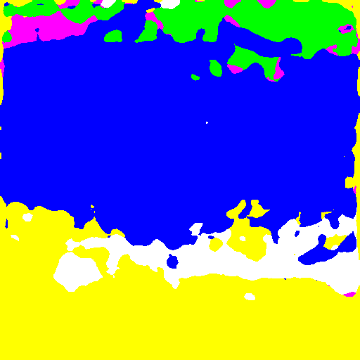
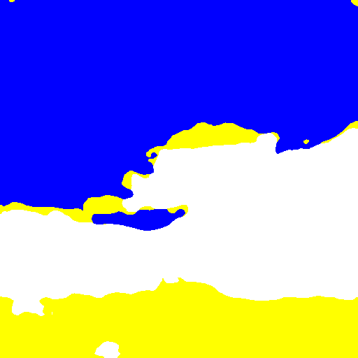
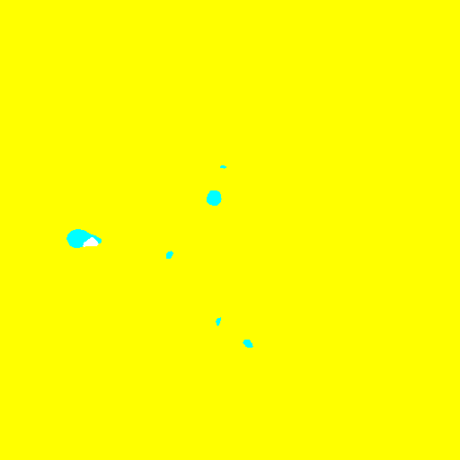
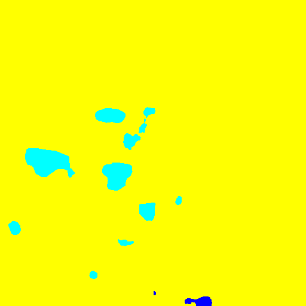
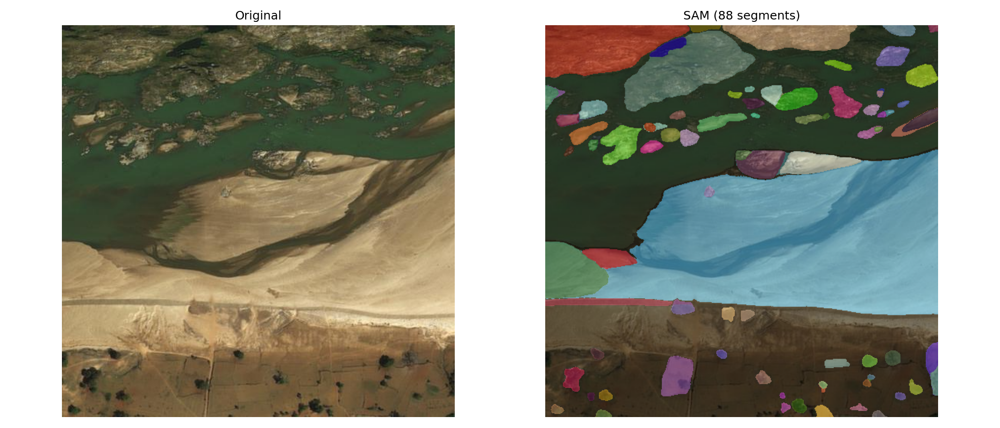
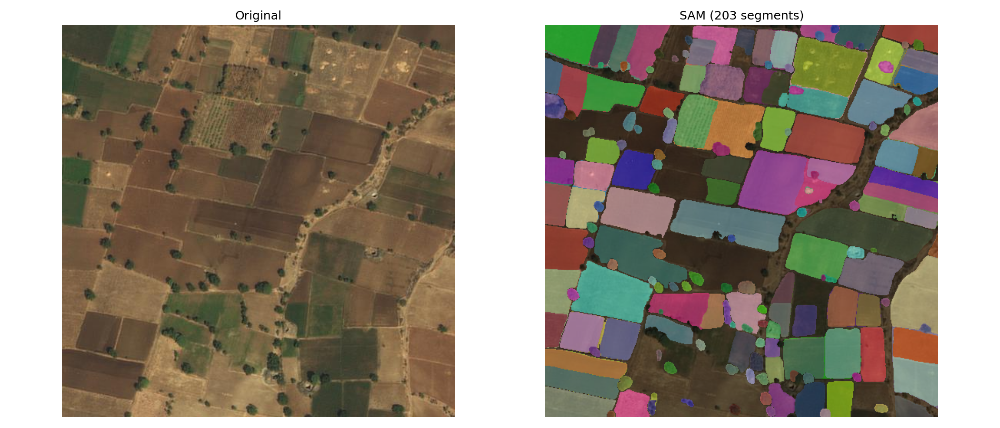
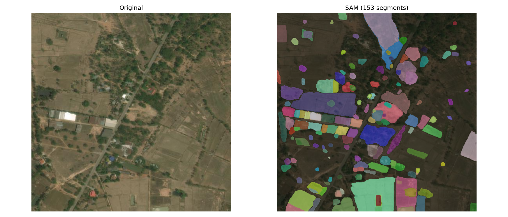

# HW1 Problem 2: Semantic Segmentation

## Color Legend

| Color | Class |
|-------|-------|
| (0, 0, 0) Black | Unknown (ignored in mIoU) |
| (0, 0, 255) Blue | Water |
| (0, 255, 0) Green | Forest |
| (0, 255, 255) Cyan | Agriculture |
| (255, 0, 255) Magenta | Urban |
| (255, 255, 0) Yellow | Rangeland |
| (255, 255, 255) White | Barren |

---

## Report 1: Ablation Study — Skip Connection Dropout

### Method

The standard U-Net architecture has 4 skip connections between encoder and decoder (levels 1–4). For the ablation study, skip connection at **level 2** (encoder output after the second downsampling block, 128 channels, spatial resolution 128×128) was dropped during training. When dropped, the corresponding encoder feature map is replaced with a zero tensor, so the decoder at that layer receives no spatial information from the encoder.

### Results

| Model | Val mIoU |
|-------|----------|
| Standard U-Net (Model A) | 0.5867 |
| U-Net with skip 2 dropped | 0.5735 |

### Analysis

Dropping skip connection 2 reduces mIoU by ~0.013. Skip connections in U-Net pass fine-grained spatial detail from the encoder to the decoder, helping recover precise object boundaries after repeated downsampling. Removing level 2 forces the decoder to reconstruct mid-level features (edges, textures at 128×128 resolution) purely from upsampled deeper features, leading to less accurate boundary delineation. The relatively small drop suggests that the remaining three skip connections partially compensate, but the loss of mid-level spatial detail still hurts overall segmentation quality.

---

## Report 2: Improved Model (Model B) — DeepLabV3+

### Architecture

Model B is **DeepLabV3+** with a pretrained ResNet50 backbone. The key components are:

**Encoder (ResNet50 with dilated convolutions):**
- Layers 1–2 use standard strides (stride 4 total output)
- Layer 3 uses dilation=2 (stride removed), Layer 4 uses dilation=4 (stride removed)
- This produces high-resolution feature maps (stride 8) instead of stride 32

**ASPP (Atrous Spatial Pyramid Pooling):**
- Captures multi-scale context via parallel atrous convolutions with rates {1, 6, 12, 18}
- Global average pooling branch for image-level context
- All branches concatenated and projected to 256 channels

**Decoder:**
- Low-level features from Layer 1 (256ch) projected to 48ch
- Upsampled ASPP output concatenated with low-level features
- Two 3×3 conv layers refine the combined features
- Final 1×1 conv outputs 7-class logits
- Bilinear upsampling to original 512×512

**Differences from U-Net:**
- U-Net uses a symmetric encoder-decoder with 4 skip connections at every resolution level. DeepLabV3+ uses only one low-level skip (from layer 1) and relies primarily on ASPP for multi-scale context rather than hierarchical skip connections.
- DeepLabV3+ uses a pretrained ImageNet backbone (ResNet50), giving it a strong feature initialization. U-Net was trained from scratch.
- Dilated convolutions in DeepLabV3+ maintain larger feature map resolution without losing receptive field, whereas U-Net uses max pooling to downsample.
- DeepLabV3+ uses differential learning rates: backbone layers use 0.1× the base LR, while the ASPP and decoder use the full LR.

---

## Report 3: mIoU on Validation Set

| Model | Val mIoU |
|-------|----------|
| A: U-Net | 0.5867 |
| B: DeepLabV3+ | 0.7333 |

---

## Report 4: Predicted Segmentation Masks During Training (Model B)

Masks predicted at epoch 1 (early), epoch 50 (middle), and epoch 100 (final) for three validation images.

### 0013_sat.jpg

| Epoch 1 | Epoch 50 | Epoch 100 |
|---------|----------|-----------|
|  |  |  |

### 0065_sat.jpg

| Epoch 1 | Epoch 50 | Epoch 100 |
|---------|----------|-----------|
|  |  |  |

### 0104_sat.jpg

| Epoch 1 | Epoch 50 | Epoch 100 |
|---------|----------|-----------|
|  |  |  |

### Analysis

For `0013_sat.jpg` (water + barren + rangeland scene), the epoch 1 prediction is noisy with many misclassified urban (magenta) and agriculture (cyan) patches. By epoch 50 the major regions (water in blue, barren in white, rangeland in yellow) are correctly identified with cleaner boundaries. The final epoch 100 refines the boundary between water and barren land further.

For `0065_sat.jpg` and `0104_sat.jpg`, which are predominantly rangeland (yellow), the model quickly converges to the dominant class even at epoch 1, with minor improvements in the small cyan (agriculture) regions over training.

---

## Report 5: Segment Anything Model (SAM)

### Method

We used **SAM ViT-H** (`sam_vit_h_4b8939.pth`) with `SamAutomaticMaskGenerator` in fully automatic mode — no prompts (no points or boxes) are provided. SAM automatically generates masks by sampling a grid of points across the image and predicting masks for each point. Key parameters:
- `points_per_side=32` — 32×32 = 1024 candidate points
- `pred_iou_thresh=0.88` — filters low-confidence masks
- `stability_score_thresh=0.95` — filters unstable masks
- `min_mask_region_area=200` — removes tiny spurious regions

The output is a set of instance-level segments (not semantic classes). Each segment is assigned a random color for visualization.

### Results

**0013_sat.jpg** (88 segments — river, barren land, agricultural fields)

SAM successfully delineates the large river body and surrounding barren/rocky terrain as distinct segments. The vegetation patches along the riverbank are also separated into fine-grained regions.

**0065_sat.jpg** (203 segments — agricultural fields)

SAM excels at segmenting the regularly-shaped agricultural field parcels, producing clean rectangular segments that closely follow field boundaries. This is a strong result for instance-level segmentation, though SAM has no concept of semantic class labels.

**0104_sat.jpg** (153 segments — mixed urban/rangeland)

SAM identifies individual buildings, roads, and vegetation clusters in this mixed urban-rangeland scene. Small structures like buildings are captured as separate segments, demonstrating SAM's strong generalization to satellite imagery without any fine-tuning.

### Discussion

SAM operates as a class-agnostic instance segmenter — it produces geometrically accurate segments but cannot assign semantic labels (water, forest, etc.). For our task (7-class semantic segmentation with mIoU), SAM cannot be directly evaluated with the same metric as Models A and B without an additional label assignment step. However, it demonstrates strong zero-shot spatial understanding of satellite imagery.
