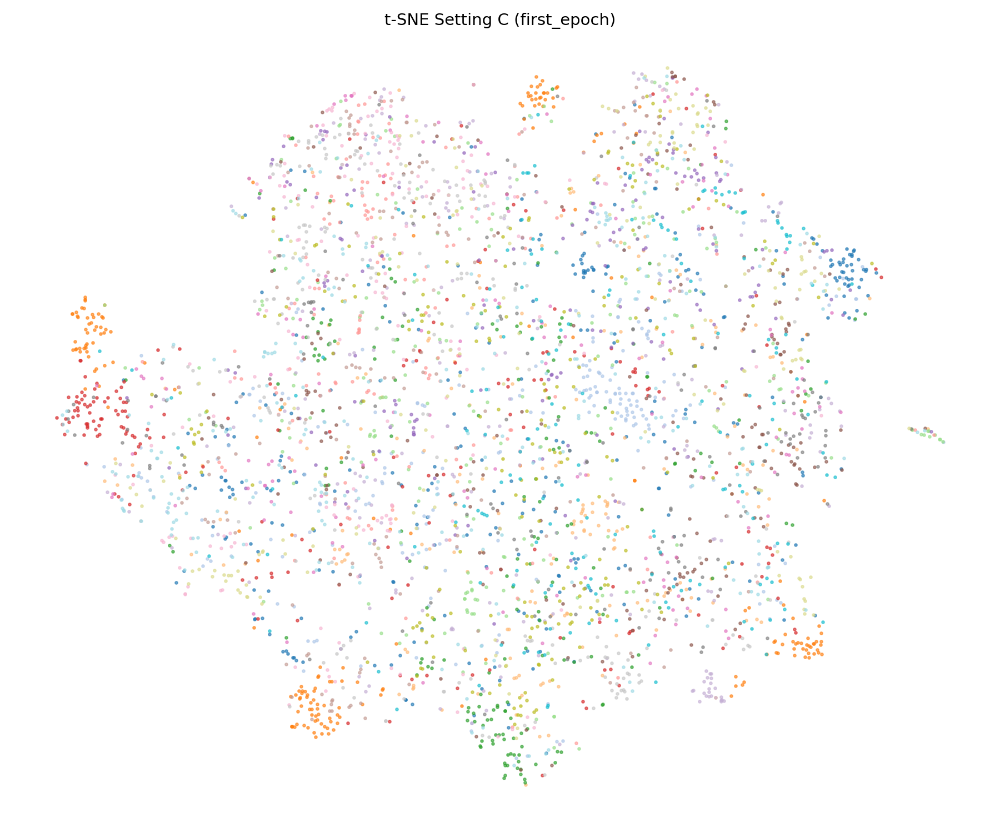
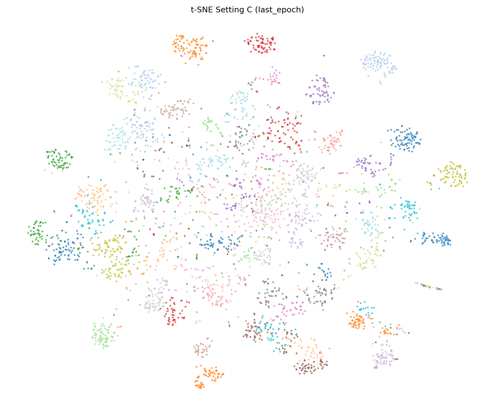

# HW1 Problem 1: Self-Supervised Pre-training for Image Classification

## REPORT1: SSL Pre-training Implementation Details

The ResNet50 backbone was pre-trained on Mini-ImageNet (38,400 unlabeled 84×84 images) using DINO (Self-Distillation with No Labels). Since Mini-ImageNet images are stored flat without class subdirectories, a custom `FlatImageDataset` was implemented to replace the default `ImageFolder` loader in the DINO codebase.

**Training configuration:**
- Optimizer: AdamW
- Learning rate: 5e-4, with cosine schedule (min lr: 1e-6)
- Warm-up epochs: 10
- Batch size per GPU: 128 × 6 GPUs (NVIDIA H200)
- Total epochs: 200
- Weight decay: 0.04 → 0.4 (cosine schedule)
- Multi-crop: 2 global crops (scale 0.4–1.0) + 8 local crops (scale 0.05–0.4)
- Input size: 224×224 (resized from 84×84 via augmentation)
- No pretrained weights loaded; trained from random initialization

Total pre-training time: ~58 minutes on 6× H200 GPUs.

---

## REPORT2: Image Classification on Office-Home

### Results Table

| Setting | Pre-training (Mini-ImageNet) | Fine-tuning (Office-Home) | Val Accuracy |
|---------|------------------------------|---------------------------|--------------|
| A | — | Full model (backbone + classifier) | 0.5074 |
| B | DINO on ImageNet-1k (TA provided) | Full model (backbone + classifier) | 0.8153 |
| C | w/o label (SSL pre-trained backbone) | Full model (backbone + classifier) | 0.6823 |
| D | DINO on ImageNet-1k (TA provided) | Fix backbone, train classifier only | 0.8054 |
| E | w/o label (SSL pre-trained backbone) | Fix backbone, train classifier only | 0.4532 |

*All settings use the same ResNet50 + linear classifier architecture. Fine-tuned for 50 epochs with AdamW (lr=1e-3, cosine schedule) on Office-Home (3,951 train / 406 val images, 65 classes).*

### Discussion

Setting B achieves the highest accuracy (0.8153), demonstrating the value of large-scale pre-training on diverse data (ImageNet-1k). Our SSL pre-trained backbone (Setting C, 0.6823) substantially outperforms random initialization (Setting A, 0.5074), confirming that DINO on Mini-ImageNet learns transferable visual representations even without labels.

Comparing B vs. D (0.8153 vs. 0.8054) shows that fine-tuning the full model slightly improves over a frozen backbone when the pre-training is strong, as the backbone can adapt its features to the target domain. The large gap between C (0.6823) and E (0.4532) reveals that our SSL backbone — trained on a smaller, lower-resolution dataset — benefits significantly from backbone fine-tuning. When frozen (Setting E), its features are not discriminative enough for Office-Home, even underperforming random-init full fine-tuning (Setting A).

---

## REPORT3: t-SNE Visualization of Setting C

t-SNE was applied to the output of the second-last layer (avgpool features, 2048-dim) of the Setting C model on the Office-Home training set. Two checkpoints were compared: after epoch 1 and after the final epoch (best checkpoint).

### First Epoch

### Last Epoch

### Analysis

After epoch 1, the feature space is largely unstructured — points from different classes are heavily mixed with no clear cluster boundaries, reflecting that the classifier has barely begun to adapt the SSL features to the Office-Home label space. By the final epoch, distinct clusters emerge for most of the 65 classes, with same-color points grouping tightly together and separating from other classes. This progression confirms that fine-tuning successfully reshapes the SSL-learned representations into class-discriminative features for the downstream task.