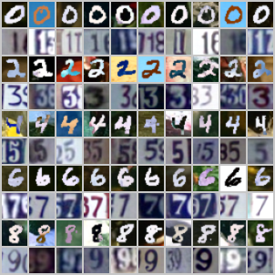
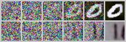

# HW2 Problem 1: Conditional Diffusion Model

## 1. Implementation Details

### Model Architecture
I implemented a conditional DDPM using the provided UNet as the backbone. To support two-condition generation (digit class + dataset type), I created a `ConditionalUNet` wrapper that injects conditioning information into the time embedding. Specifically:

- **Digit class embedding**: `nn.Embedding(11, time_dim)` where index 10 is the null token for CFG dropout
- **Dataset embedding**: `nn.Embedding(3, time_dim)` where index 2 is the null token (0=MNIST-M, 1=SVHN)
- Both embeddings are added element-wise to the UNet's time embedding before being passed through the network

### Classifier-Free Guidance (CFG)
Following [Ho & Salimans 2022](https://arxiv.org/abs/2207.12598), during training both conditions are independently dropped with probability `p=0.1`, replaced by null tokens. During inference, the guided noise prediction is:

$$\hat{\epsilon} = \epsilon_\theta(x_t, \emptyset) + s \cdot (\epsilon_\theta(x_t, c) - \epsilon_\theta(x_t, \emptyset))$$

where $s=3.0$ is the guidance scale.

### Training Details
- **Dataset**: MNIST-M (56,000) + SVHN (79,431) jointly, total 135,431 images
- **Image size**: Resized to 32×32 (UNet requires power-of-2 spatial dims)
- **Noise schedule**: Linear, $\beta_1=10^{-4}$ to $\beta_T=0.02$, $T=1000$
- **Optimizer**: Adam, lr=2e-4, batch size=128
- **Epochs**: 100, final loss ≈ 0.0127
- **Conditioning rule**: even digits (0,2,4,6,8) → MNIST-M style; odd digits (1,3,5,7,9) → SVHN style

### Difficulties
- The provided UNet was designed for 256×256 inputs. Using 28×28 caused mismatched spatial sizes in skip connections due to odd dimensions after downsampling. Fixed by resizing inputs to 32×32 and resizing outputs back to 28×28 at save time.
- PyTorch 1.11.0 is incompatible with NVIDIA H200 (sm_90). Upgraded to PyTorch 2.4.0+cu124.

---

## 2. Generated Images (10 per digit)

Rows = digits 0–9, Columns = 10 different samples. Even digits (rows 0,2,4,6,8) are MNIST-M style; odd digits (rows 1,3,5,7,9) are SVHN style.

---

## 3. Reverse Process Visualization

Six timesteps shown for the first generated "0" (MNIST-M, top row) and first "1" (SVHN, bottom row). Columns: $t=1000, 800, 600, 400, 200, 1$.

---

## 4. Evaluation Results

| Dataset | Correct | Total | Accuracy |
|---------|---------|-------|----------|
| MNIST-M | 250     | 250   | 100.00%  |
| SVHN    | 248     | 250   | 99.20%   |
| **Average** | | | **99.60%** |

Exceeds the strong baseline of 95.00%.