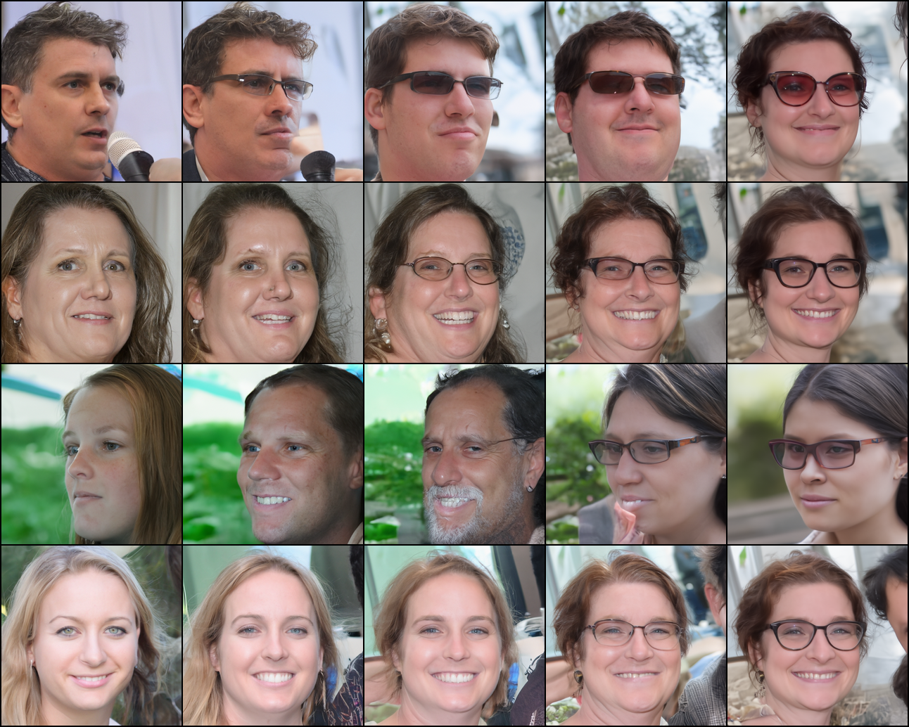

# HW2 Problem 2: DDIM

## 1. Implementation Details

### DDIM Sampling
Following [Song et al. 2020](https://arxiv.org/abs/2010.02502), the DDIM update rule is:

$$x_{t-1} = \sqrt{\bar{\alpha}_{t-1}} \cdot \hat{x}_0 + \sqrt{1 - \bar{\alpha}_{t-1} - \sigma_t^2} \cdot \epsilon_\theta(x_t, t) + \sigma_t z$$

where $\hat{x}_0 = \frac{x_t - \sqrt{1-\bar{\alpha}_t}\,\epsilon_\theta(x_t,t)}{\sqrt{\bar{\alpha}_t}}$ and $\sigma_t = \eta \sqrt{\frac{1-\bar{\alpha}_{t-1}}{1-\bar{\alpha}_t}} \sqrt{1 - \frac{\bar{\alpha}_t}{\bar{\alpha}_{t-1}}}$.

- **Beta schedule**: linear from $10^{-4}$ to $0.02$ via `beta_scheduler()` in `utils.py`
- **Timesteps**: uniform 50-step schedule — $981, 961, 941, \ldots, 1$ (step size = 20)
- **Saving**: `torchvision.utils.save_image` with `normalize=True`
- **eta=0**: deterministic sampling (DDIM), matching GT with MSE = 2.27

### Evaluation Results

| Image | MSE |
|-------|-----|
| 00 | 1.38 |
| 01 | 1.82 |
| 02 | 2.20 |
| 03 | 2.67 |
| 04 | 2.64 |
| 05 | 4.70 |
| 06 | 2.97 |
| 07 | 1.30 |
| 08 | 1.40 |
| 09 | 1.66 |
| **Average** | **2.27** |

---

## 2. Effect of eta on Generated Images

Rows = noise inputs 00–03. Columns = $\eta = 0.0, 0.25, 0.5, 0.75, 1.0$.

**Observation**: When $\eta=0$ (DDIM), sampling is fully deterministic — the same noise always produces the same image. As $\eta$ increases, stochasticity is introduced at each step (similar to DDPM when $\eta=1$). The overall face identity is preserved across $\eta$ values, but fine details (hair, background texture) vary more with higher $\eta$. Higher $\eta$ also tends to produce slightly noisier or softer images due to the added Gaussian noise at each denoising step.

---

## 3. Noise Interpolation

### Spherical Linear Interpolation (Slerp)

Columns = $\alpha = 0.0, 0.1, 0.2, \ldots, 1.0$ interpolating between noise 00 and noise 01.

$$x_T^{(\alpha)} = \frac{\sin((1-\alpha)\theta)}{\sin\theta} x_T^{(0)} + \frac{\sin(\alpha\theta)}{\sin\theta} x_T^{(1)}, \quad \theta = \arccos\!\left(\frac{(x_T^{(0)})^\top x_T^{(1)}}{|x_T^{(0)}||x_T^{(1)}|}\right)$$

### Linear Interpolation

$$x_T^{(\alpha)} = (1-\alpha)\,x_T^{(0)} + \alpha\,x_T^{(1)}$$

**Observation**: Slerp produces a smooth, perceptually uniform transition between the two faces — identity, expression, and lighting change gradually and naturally across $\alpha$. Linear interpolation, by contrast, tends to produce blurrier intermediate images because it reduces the magnitude of the noise vector (the interpolated vector has smaller norm than either endpoint), pushing the sample toward lower-energy regions of the latent space. This causes the intermediate faces to appear washed-out or unnaturally blended compared to slerp.
