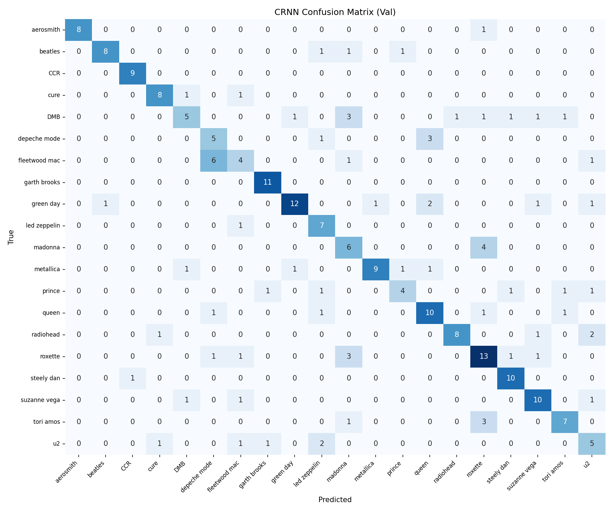
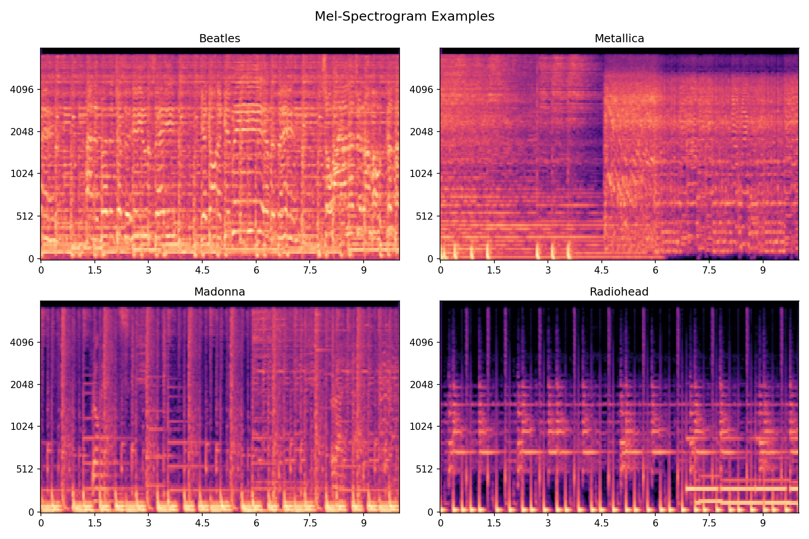
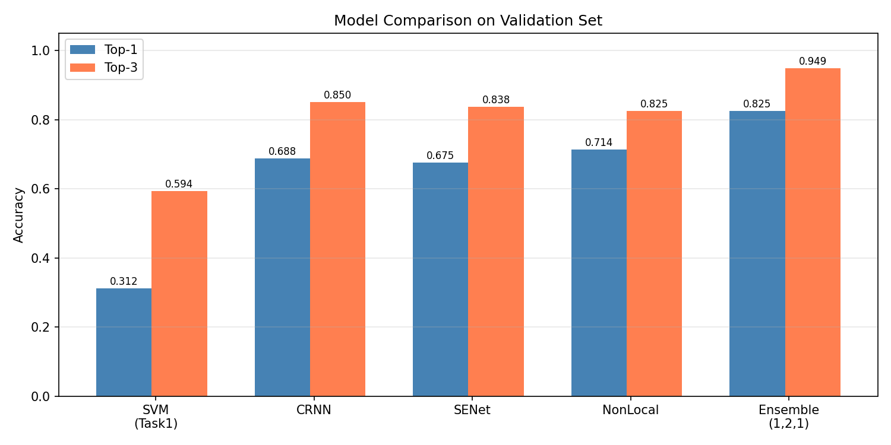
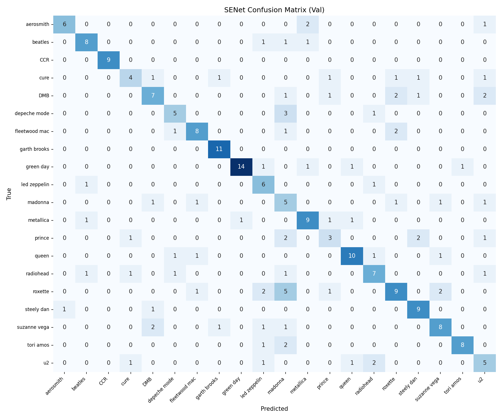
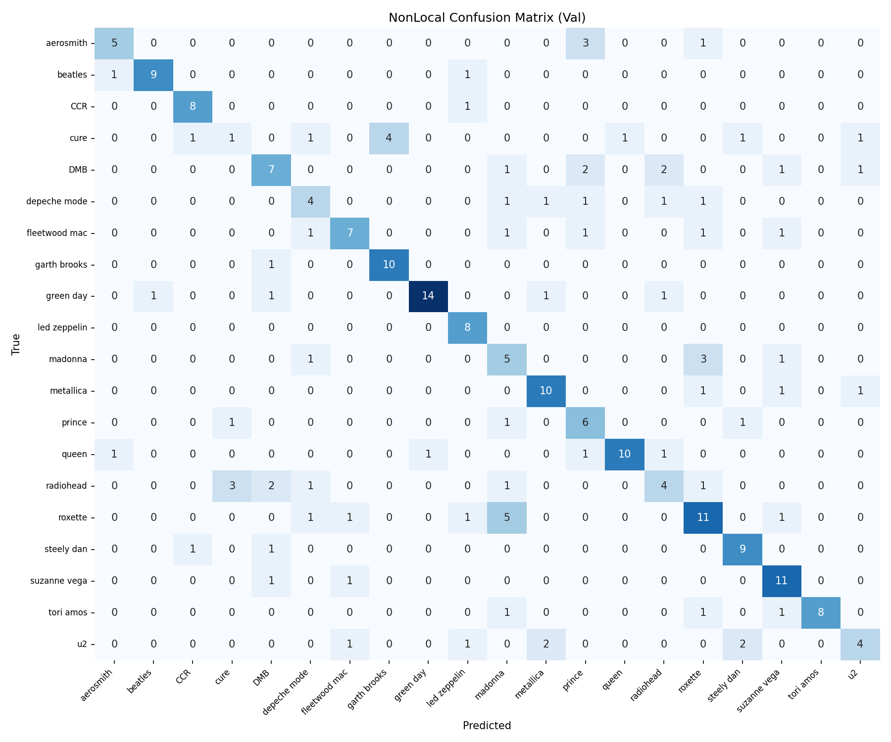

tudent ID:** [R13921031]

---

## 1. Overview

This report presents a singer classification system trained on the **Artist20** dataset (20 artists, 1413 tracks, 16kHz mono MP3). The task is to predict the artist given an audio clip.

**Dataset Split (album-level):**

| Split | Tracks |
|-------|--------|
| Train | 946 |
| Validation | 234 |
| Test | 233 |

The train/val split follows an album-level strategy: for each artist, 4 albums are used for training and 1 album for validation, preventing data leakage at the album level.

---

## 2. Task 1: Traditional Machine Learning

### 2.1 Feature Extraction

Features are extracted using **Librosa** from three 5-second segments per track (start, middle, end), then averaged. For each segment, the following features are computed:

| Feature | Dim |
|---------|-----|
| MFCC (mean + std) | 80 |
| Delta MFCC (mean + std) | 80 |
| Delta² MFCC (mean + std) | 80 |
| Chroma (mean + std) | 24 |
| Spectral Contrast (mean + std) | 14 |
| Zero Crossing Rate (mean + std) | 2 |
| **Total** | **280** |

**Preprocessing:** Features are standardized using `StandardScaler` (zero mean, unit variance) before training.

### 2.2 Classifier: SVM

A **Support Vector Machine** with RBF kernel (`C=10`, `gamma='scale'`) is trained using Scikit-learn. SVM is well-suited for high-dimensional feature spaces and has shown strong performance on audio classification tasks.

### 2.3 Results

| Metric | Train | Validation |
|--------|-------|------------|
| Top-1 Accuracy | 1.000 | 0.312 |
| Top-3 Accuracy | 1.000 | 0.594 |

The large gap between train and val accuracy indicates overfitting, likely due to the small dataset size. The model memorizes per-track statistics that don't generalize across albums.

**Validation Confusion Matrix:**



---

## 3. Task 2: Deep Learning

### 3.1 Preprocessing

All models share the same input pipeline:

- Load audio at 16kHz, convert to mono
- Randomly crop a **10-second** segment (random offset during training)
- Compute **Mel-spectrogram**: 128 mel bins, FFT size 2048, hop length 256–512
- Convert to dB scale with `AmplitudeToDB(top_db=80)`
- Per-sample normalization: subtract mean, divide by std

**Data Augmentation (training only):**
- `TimeMasking(time_mask_param=50)` — randomly masks time frames
- `FrequencyMasking(freq_mask_param=20)` — randomly masks frequency bands

**Mel-Spectrogram Examples:**



---

### 3.2 Model A: CRNN

**Reference:** Nasrullah & Tan, *"Musical artist classification with convolutional recurrent neural networks,"* IJCNN 2019.

The CRNN combines a CNN encoder to extract local spectral features with a bidirectional GRU to model temporal patterns, followed by attention pooling.

**Architecture:**

```
Input (1, 128, T)
  → 4× ConvBlock (64→128→256→256) with MaxPool
  → Reshape to (T', 1024) time sequence
  → Bidirectional GRU (256 hidden, 2 layers)
  → Attention Pooling
  → FC(512) → Dropout(0.5) → FC(20)
```

Each ConvBlock consists of two Conv2d + BatchNorm + ELU layers followed by MaxPool and Dropout.

**Training:** AdamW, lr=3e-4, CosineAnnealingLR, label smoothing=0.1, 150 epochs, batch size=32, 3 segments/track/epoch.

---

### 3.3 Model B: SE-ResNet

**Reference:** Inspired by squeeze-and-excitation networks and music classification literature.

A ResNet-style CNN with **Squeeze-and-Excitation (SE) blocks** that recalibrate channel-wise feature responses, helping the model focus on the most discriminative frequency bands for each singer.

**Architecture:**

```
Input (1, 128, T)
  → Stem: Conv7×7, MaxPool
  → Layer1: 2× ConvSEBlock (32→64)
  → Layer2: 2× ConvSEBlock (64→128, stride=2)
  → Layer3: 2× ConvSEBlock (128→256, stride=2)
  → Layer4: 2× ConvSEBlock (256→512, stride=2)
  → AdaptiveAvgPool → Dropout(0.5) → FC(256) → FC(20)
```

Each ConvSEBlock has a residual connection and an SE module (global avg pool → FC → sigmoid).

**Training:** AdamW, lr=3e-4, OneCycleLR scheduler, label smoothing=0.1, 120 epochs, batch size=64, 5 segments/track/epoch.

---

### 3.4 Model C: Non-Local Network

**Reference:** *"Positions, channels, and layers fully generalized non-local network for singer identification,"* AAAI 2021.

Non-local blocks capture **long-range dependencies** across the time-frequency plane. Unlike convolutions that only look at local neighborhoods, the non-local operation computes attention over all positions, allowing the model to relate distant time frames and frequency bands.

**Architecture:**

```
Input (1, 128, T)
  → Stem: Conv7×7, MaxPool
  → Layer1: ConvBlock (32→64)
  → Layer2: ConvBlock + NonLocalBlock (64→128)
  → Layer3: ConvBlock + NonLocalBlock (128→256)
  → Layer4: ConvBlock + NonLocalBlock (256→512)
  → AdaptiveAvgPool → Dropout(0.5) → FC(256) → FC(20)
```

The Non-Local Block computes: `out = x + SE_channel_attention(W_z * softmax(θ(x)ᵀφ(x)) * g(x))`

**Training:** AdamW, lr=3e-4, CosineAnnealingLR, label smoothing=0.1, 120 epochs, batch size=32, 5 segments/track/epoch.

---

### 3.5 Test-Time Augmentation (TTA)

At inference, each track is split into **10 random segments**. The predicted probability distributions are averaged before taking the top-3 predictions. This significantly improves accuracy by reducing the variance of single-segment predictions.

---

### 3.6 Ensemble

The three models are ensembled by **weighted averaging** of their softmax probability outputs (after TTA). The optimal weights were found by grid search on the validation set:

| Model | Weight |
|-------|--------|
| CRNN | 1 |
| SE-ResNet | 2 |
| Non-Local Net | 1 |

---

## 4. Results

### 4.1 Validation Accuracy

| Model | Top-1 | Top-3 |
|-------|-------|-------|
| SVM (Task 1) | 0.312 | 0.594 |
| CRNN | 0.688 | 0.850 |
| SE-ResNet | 0.675 | 0.838 |
| Non-Local Net | 0.714 | 0.825 |
| **Ensemble (1,2,1)** | **0.825** | **0.949** |



### 4.2 Confusion Matrices

**CRNN:**


**SE-ResNet:**



**Non-Local Network:**



### 4.3 Scoring (Prediction)

Using the ensemble on the test set:

$$\text{Score} = \text{Top-1 Acc} + 0.5 \times \text{Top-3 Acc}$$

Estimated from validation: $0.825 + 0.5 \times 0.949 = 1.299$

---

## 5. Discussion

- **SVM** overfits due to limited data but achieves reasonable Top-3 accuracy (0.594), showing MFCC features carry discriminative singer information.
- **CRNN** benefits from temporal modeling via GRU — capturing long-term vocal patterns across the segment.
- **SE-ResNet** achieves strong results through channel-wise attention, automatically weighting important frequency bands per artist.
- **Non-Local Net** performs best among individual models (0.714), validating that long-range time-frequency dependencies are important for singer identification.
- **Ensemble** consistently outperforms all individual models, combining complementary strengths of each architecture.
- **TTA** with 10 segments gave a large boost (0.65 → 0.77 for CRNN alone), showing single-segment predictions are noisy.

---

## 6. References

1. Nasrullah & Tan, *"Musical artist classification with convolutional recurrent neural networks,"* IJCNN 2019.
2. Hsieh et al., *"Addressing the confounds of accompaniments in singer identification,"* ICASSP 2020.
3. [AAAI 2021] *"Positions, channels, and layers fully generalized non-local network for singer identification."*
4. Hu et al., *"Squeeze-and-Excitation Networks,"* CVPR 2018.
